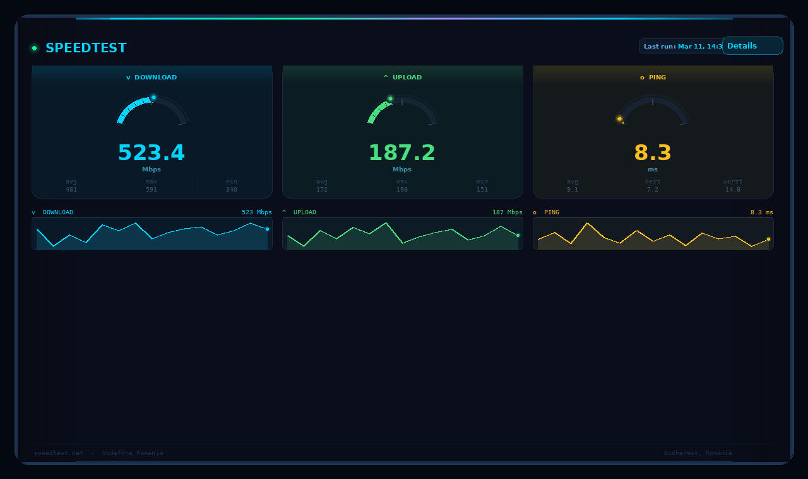

# ⚡ Speedtest Card

[](https://github.com/hacs/integration)


A premium, cyber-themed Lovelace card for the [Speedtest.net](https://www.home-assistant.io/integrations/speedtestdotnet/) integration.  
Beautiful arc gauges for download, upload and ping — with sparklines, animated details and fully interactive history charts with hover tooltips.

---



---

## ✨ Features

- **3 arc gauges** — Download (cyan), Upload (green), Ping (yellow) with animated glow tip
- **Sub-stats** — avg / max / min pulled from the last 24 h of recorded history
- **Sparklines** — last 30 tests rendered per metric with fill gradient
- **⊞ Details modal** — opens a full history overlay with:
  - Period selector: 6 h / 24 h / 3 d / 7 d / 30 d / All
  - Summary stat cards (avg, best, worst, test count)
  - **Download + Upload** combined line chart
  - **Ping** line chart
  - **Hover tooltips** — crosshair + floating card showing exact values at cursor position (mouse & touch)
  - Full test log table (timestamp, speeds, server)
- **Persistent history** — stored in `localStorage`, survives HA restarts, up to 100 entries
- **Zero dependencies** — pure vanilla JS, no frameworks, no external libraries

---

## 📦 Installation

### Via HACS (recommended)

1. In HACS go to **Frontend → Custom repositories**
2. Add this repository URL, category **Lovelace**
3. Install **Speedtest Card**
4. Reload your browser

### Manual

1. Download `speedtest-card.js`
2. Copy to `config/www/speedtest-card.js`
3. Go to **Settings → Dashboards → Resources → Add resource**
   - URL: `/local/speedtest-card.js`
   - Type: `JavaScript Module`
4. Reload your browser

---

## 🚀 Usage

```yaml
type: custom:speedtest-card
entity_download: sensor.speedtest_download
entity_upload: sensor.speedtest_upload
entity_ping: sensor.speedtest_ping
```

### Configuration options

| Option | Type | Default | Description |
|--------|------|---------|-------------|
| `entity_download` | string | `sensor.speedtest_download` | Download speed entity (Mbit/s) |
| `entity_upload` | string | `sensor.speedtest_upload` | Upload speed entity (Mbit/s) |
| `entity_ping` | string | `sensor.speedtest_ping` | Ping entity (ms) |
| `max_download` | number | `1000` | Max value for the download gauge scale |
| `max_upload` | number | `500` | Max value for the upload gauge scale |
| `max_ping` | number | `200` | Max value for the ping gauge scale |

### Full example

```yaml
type: custom:speedtest-card
entity_download: sensor.speedtest_download
entity_upload: sensor.speedtest_upload
entity_ping: sensor.speedtest_ping
max_download: 1000
max_upload: 500
max_ping: 100
```

---

## 📊 History & Tooltips

Every time Home Assistant updates the speedtest sensors, the card automatically records the reading into `localStorage`. History persists across page reloads and HA restarts.

Click **⊞ Details** to open the history modal:

- Use the **period buttons** to zoom in or out (6 h → All time)
- Hover over any chart to see a **crosshair** and a **floating tooltip** with exact values for that point in time
- Works on **touch screens** too (tap and drag)
- The **test log table** shows your last 50 runs with full detail

> History is stored per browser. If you access your dashboard from multiple devices, each will maintain its own local history.

---

## 🤝 Requirements

- Home Assistant 2023.1 or newer
- [Speedtest.net integration](https://www.home-assistant.io/integrations/speedtestdotnet/) installed and configured
- Entities must expose numeric state values in Mbit/s (download/upload) and ms (ping)

---

## 🎨 Design

Shares the same cyber / dark-terminal aesthetic as the [Network Scanner Card](https://github.com/your-username/network-scanner-card):

- Dark navy backgrounds with subtle grid overlay
- Animated rainbow top bar
- Per-metric colour coding — cyan (↓), green (↑), yellow (◎)
- Glowing arc gauges with gradient fill and luminous tip dot
- Smooth transitions and hover effects throughout

---

## 📝 License

MIT — free to use, modify and distribute.
